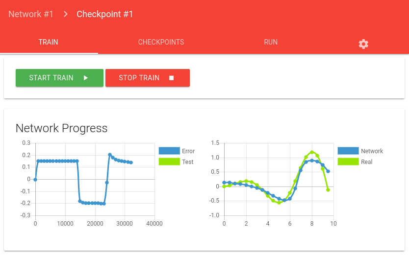

# OpenHabAI [](https://gitlab.com/PancakeSoftware/openHabAI/commits/master) <br>
Automate your home using Neuronal networks. <br>
OpenHabAI provides a fast c++ backend 
([mxnet is used for computation](http://mxnet.io)) and frontend that run in browser.

To see api documentation look at: [catflow/README.md](catflow/README.md)

## Install
Download [install-packages](https://gitlab.com/PancakeSoftware/openHabAI/-/jobs/artifacts/master/download?job=install-packages) from artifacts. Extract it and install the .deb package.
```bash
cd build/pack
dpkg --install OpenHabAI-0.0.0-Linux.deb
# resolve deps 
apt-get install -f                          
```

## Build from Source 
First **install** these packages:
* For **frontend**
    * nodejs
    * npm
* For **trainServer**
    * zlib1g-dev
    * openssl-devel
    * zlib-devel
    * for **mxnet**
        * libopenblas-dev 
        * liblapack-dev
        * *cuda (optional, if you want to use gpu)* [see at mxnet.io](http://mxnet.io/get_started/build_from_source.html#optional-cuda-cudnn-for-nvidia-gpus)
    * cmake, git, c++ build tools
    
Execute build command:
```bash
mkdir build
cd build
cmake ../
make 
```
The compiled trainSever executable can be found in build/bin. <br>
To run frontend: ```make frontendRun``` or see in [README of frontend](frontend-angular/README.md)

 
#### Development
To use the Websocket Api see backend-frontend [protocol definition](./doc/README.md).
##### Report Bugs and Improvements
If you found a bug or have a good idea for new a feature just [open a new issue at gitlab](https://gitlab.com/PancakeSoftware/openHabAI/issues/new).
